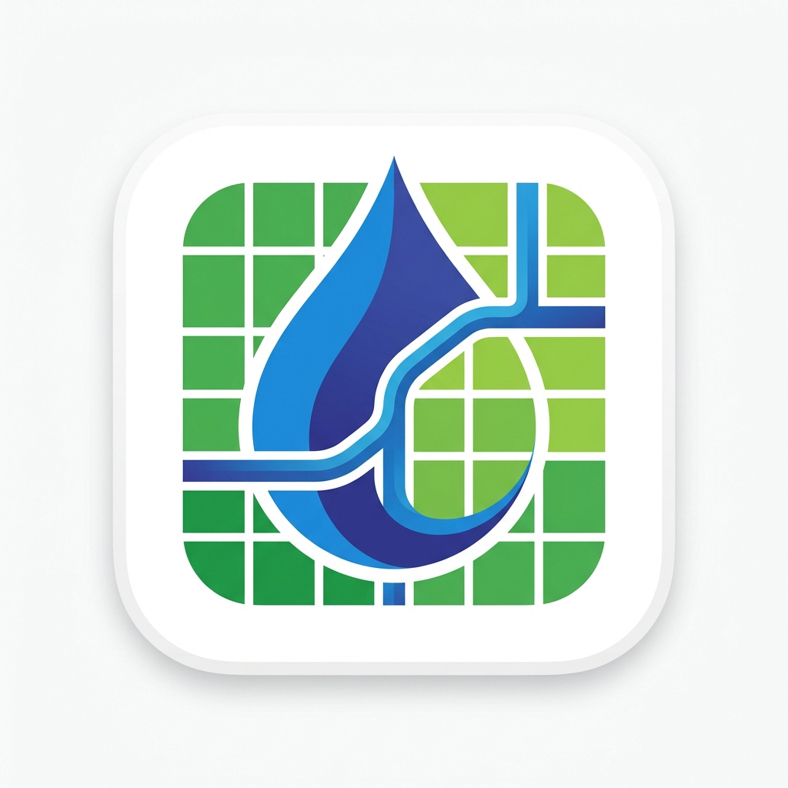

# Arazi Kanal Suyu Takip Programı

<p align="center">
  
</p>

<p align="center">
  <a href="https://github.com/ilyasbozdemir/arazi-kanal-suyu-takip-app/actions"></a>
  <a href="https://github.com/ilyasbozdemir/arazi-kanal-suyu-takip-app/releases/latest"></a>
  <a href="https://github.com/ilyasbozdemir/arazi-kanal-suyu-takip-app/releases"></a>
</p>

**Tarım Sulama Kooperatifleri, Sulama Birlikleri ve Köy Muhtarlıkları kapsamında
arazilerin kanal suyu kullanımını, merak görevlerini ve üyelik borç kayıtlarını
yönetmek için geliştirilmiş masaüstü uygulaması.**

---

## Hakkında

Arazi Kanal Suyu Takip Programı, internet bağlantısı gerektirmeyen, tamamen
**çevrimdışı (offline)** çalışan güvenli bir masaüstü otomasyonudur. Sulama
kanallarından faydalanan maliklerin (tapu sahiplerinin) arazi kayıtlarını
tutmanızı, su görevlileri (meravlar) vasıtasıyla sahada yazılan sulama fişlerini
sisteme hızlıca girmenizi ve tahsilat/borç dökümlerini yönetmenizi sağlar.

Uygulama, yerel SQLite veritabanı altyapısıyla çalışır; tüm verileriniz buluta
gitmeden tamamen kendi bilgisayarınızda güvenle saklanır. Kolay yedekleme ve
sıfırlama araçları sayesinde verileriniz her zaman sizin kontrolünüzdedir.

---

## Özellikler

- **Gelişmiş Malik (Üye) Yönetimi** — Malikleri tek bir sekmede gruplanmış
  olarak görün. Maliklerin toplam taşınmaz sayısı, toplam arazi alanları (m²) ve
  bağlı oldukları mahalle dökümlerine anında ulaşın.
- **Detaylı Kişi Dosyası ve Profil Sayfası** — Her malik için toplam sulama
  süresi, toplam borç, ödenen miktar ve kalan bakiye istatistikleri. Malik bazlı
  **A4 Borç Ekstresi** ve **A5 Sulama/Teslim Fişi** yazdırma önizleme desteği.
- **Hızlı Fiş Girişi & Doğrulama** — Sulama görevlisi (Merav) ve tarih seçimini
  en başta sabitleyerek, merakın ilgili tarihteki tüm fişlerini ekranın altında
  canlı listeleme. Tapu sahibi girerken otomatik tamamlama (autocomplete)
  desteğiyle hızlı veri girişi.
- **Taşınmaz (Arazi) Takibi** — Mahalle, mevki, ada/parsel, kanal adı ve su
  hakkı tanımları ile esnek arazi yönetimi. İster tekil formla ister Excel
  benzeri hızlı tablo görünümünde veri ekleme ve güncelleme.
- **Dinamik Kurum Ayarları** — Kurum adını, logosunu ve saatlik sulama
  tarifesini (`₺ / Saat`) sistem ayarlarından özelleştirin; tüm yazdırılabilir
  fiş ve belgelere otomatik yansıtın.
- **Tamamen Çevrimdışı Altyapı** — Verileriniz güvende, bulut sistemlere
  bağımlılık yok. Kurum içi gizlilik standartlarına tam uyum.

---

## Basıma Hazır Alabileceğiniz Belgeler

Sistemden saniyeler içinde otomatik olarak üretip çıktısını alabileceğiniz
belgeler:

- **A4 Ödeme Bildirimi ve Borç Detayı (Ekstre)**: Malikin tüm arazilerini,
  mevki/su hakkı bilgilerini ve geçmiş sulama fişlerinin ödeme durumunu içeren
  detaylı hesap dökümü.
- **A5 Sulama Hizmet / Teslim Fişi**: Sulama süresi, tarife bilgisi, merav adı,
  toplam tutar ve imza alanlarını içeren resmi teslim fişi.

---

## Kurulum ve Çalıştırma

Projenin yerel bilgisayarınızda çalıştırılması için aşağıdaki adımları takip
ediniz:

```bash
# Bağımlılıkları yükle
pnpm install

# Geliştirme modunda (React & Electron dev server) çalıştır
pnpm run dev

# Üretim için derle (Windows)
pnpm run build:win

# Alternatif platformlar için derleme (İsteğe bağlı)
pnpm run build:linux
pnpm run build:mac
```

---

## Teknolojiler

- [Electron.js](https://www.electronjs.org/) — Masaüstü uygulama çatısı
- [React](https://react.dev/) — Kullanıcı arayüzü kütüphanesi
- [Tailwind CSS](https://tailwindcss.com/) — Responsive utility-first modern
  tasarım sistemi
- [SQLite](https://www.sqlite.org/) — Yerel ilişkisel veritabanı altyapısı
- [Lucide React](https://lucide.dev/) — Premium modern ikon seti
- [Zustand](https://github.com/pmndrs/zustand) — Minimalist state yönetim
  kütüphanesi

---

## Lisans

Bu proje GNU Affero General Public License v3.0 veya üzeri kapsamında
lisanslanmıştır.

```
arazi-kanal-suyu-takip-app - Tarımsal Sulama ve Üye Takip Programı
Copyright (C) 2026 İlyas Bozdemir
```

---

## Yasal Uyarı ve Sorumluluk Reddi

**ÖNEMLİ:** Bu uygulama, tarımsal sulama birlikleri, muhtarlıklar ve
kooperatiflerin operasyonel süreçlerini kolaylaştırmak amacıyla yardımcı bir
otomasyon aracı olarak geliştirilmiştir. Uygulamadan alınan fiş, borç ekstresi,
bütçe raporları ve diğer tüm hesaplamaların doğruluğunu, güncelliğini ve yasal
mevzuata uygunluğunu kontrol etmek tamamen kullanıcının/idarenin
sorumluluğundadır. Uygulama üzerinde yapılan hatalı veri girişleri, yanlış
tarife hesaplamaları, veri kayıpları veya donanımsal arızalardan
kaynaklanabilecek aksaklıklardan dolayı geliştirici hiçbir hukuki, idari veya
mali sorumluluk kabul etmemektedir.
